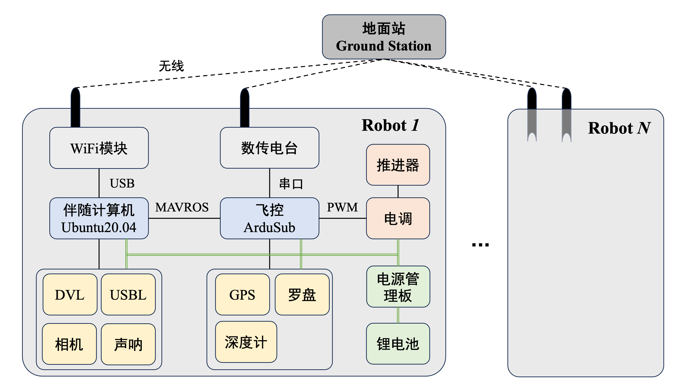

# 前言
基于课题需求，开发一款水下机器人，用于开展实验并测试算法性能。主要目的是验证水下机器人的状态估计、运动规划及控制。

# 1 基本框架概述
本章进行水下机器人的基本框架概述。本设计拟采用ArduSub飞控经典的软硬件框架，机载由飞控、伴随计算机、电源系统、传感器及扩展模块、驱动系统、通信系统构成。

**(1)飞控**:拟采用Pixhawk1，运行ArduSub固件，负责控制底层推进器、采集底层传感器信息并向伴随计算机发布MAVLINK信息。需要额外连接的传感器或模块主要包括深度传感器、GPS、外置罗盘、数传电台(用于连接地面站)等。

**(2)伴随计算机**拟采用树莓派3B+、NVIDIA Jetson，先在树莓派上做前期测试，后续需要机载运行神经网络或密集计算时，再使用Jetson。伴随计算机通过MAVROS与飞控通信，通过局域网连接地面站，向地面站发送基本运行信息，接收指令等，机器人和地面站构成星型拓扑，用于在地面站统一显示和发布指令。【注：由于在伴随计算机中运行ROS1，分布式方案不成熟，因此通过ros节点利用局域网在伴随计算机和地面站间传输信息。如果采用ROS2，可使用ROS2的分布式方案】

**(3)电源系统**拟采用10000mAh、6S锂电池供电，采用分电稳压系统分出12V、5V等常用电压，推进器功率较大，因此单独通过电池引出。

**(4)传感器及扩展模块**根据兼容性连接在不同主板上，连接在飞控(深度传感器、GPS、外置罗盘、数传电台等)和伴随计算机(WiFi模块、DVL、USBL、相机、声呐等)。

**(5)驱动系统**主要通过电调接收飞控的PWM信号，通过三相交流控制推进器转动。

**(6)通信系统**包括机器人内部与外部通信。内部主要是多个主板间的通信，飞控与伴随计算机通过MAVLINK协议通信，伴随计算机通过MAVROS解析数据包。外部主要是飞控通过数传电台与地面站通信、伴随计算机通过局域网与地面站通信，其射频信号通过防水天线从密封舱内引出。【注：无线射频信号在水中快速衰减，这种方式仅适用于水面机器人，但开发前期先完成水面调试，后续可通过缆线连接机器人与水面浮游体，机器人自身可潜入水下，通信仍可以按照目前的方案实施】

# 2 后续规划
